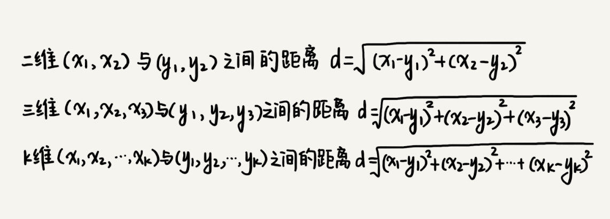
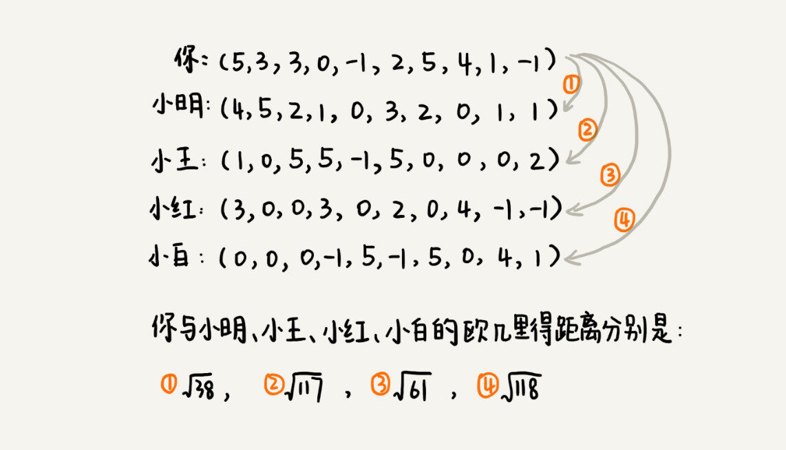
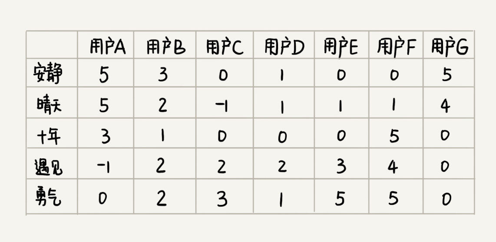

[toc]

## 47 | 向量空间：如何实现一个简单的音乐推荐系统？

1.　开篇题
	- 如何实现一个简单的音乐推荐系统？

### 核心思路

1.　找到跟你口味偏好**相似的用户**，把他们爱听的歌曲推荐给你
2.　找出跟你喜爱的歌曲特征**相似的歌曲**，把这些歌曲推荐给你。

### 基于相似用户做推荐

1. 如何定义用户对某首歌曲的喜爱程度呢？

	- 我们给每个行为定义一个得分
	- 
	- 把每个人对每首歌曲的喜爱程度表示出来
	- 

2. 如何来判断两个用户是否口味相似呢？

	1. **欧几里得距离（Euclidean distance）**。欧几里得距离是用来计算两个向量之间的距离的。
		- 

	2. 欧几里得距离距离最小，高维空间中靠得最近。所以，我们就断定，小明跟你的口味最相似。
		- 

### 基于相似歌曲做推荐

1. 如何判断两首歌曲是否相似呢？
	- 对于两首歌，如果喜欢听的人群都是差不多的，那侧面就可以反映出，这两首歌比较相似。
	- 
	- 欧几里得距离越小，表示两个歌曲越相似。

