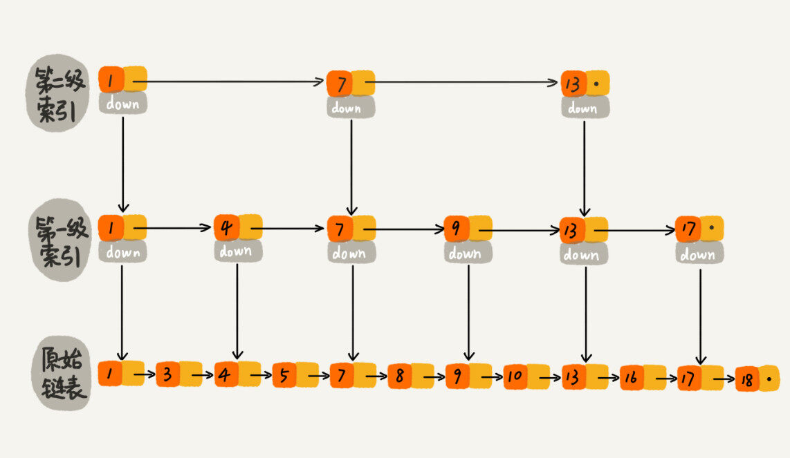
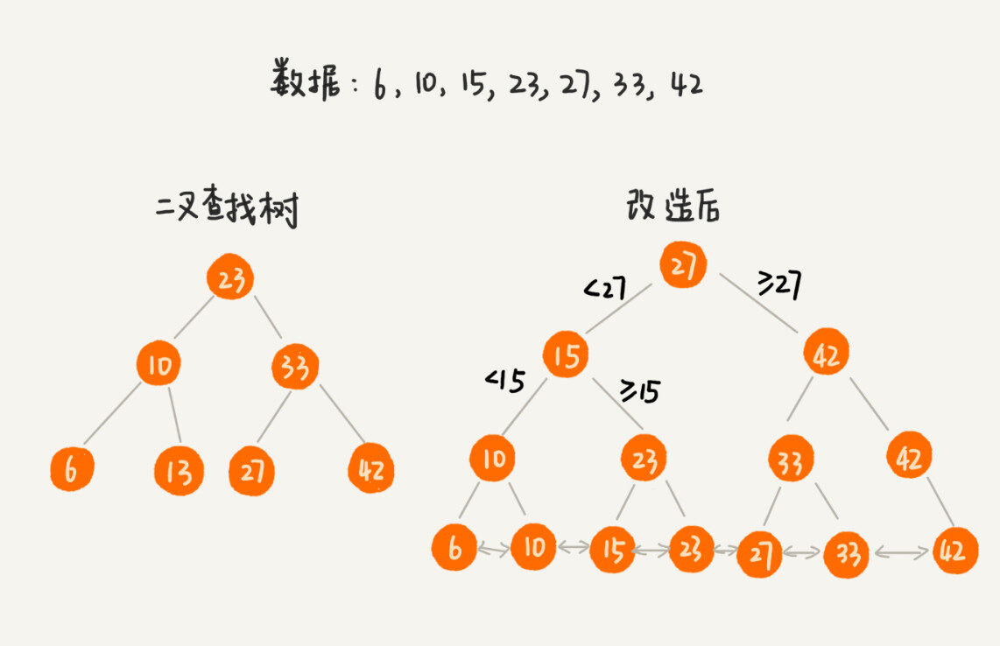
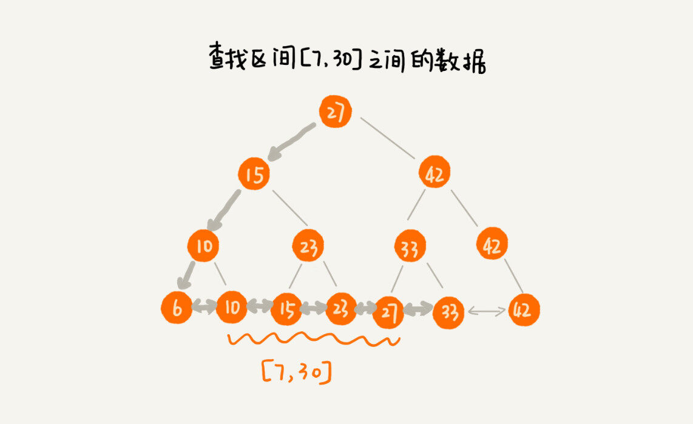
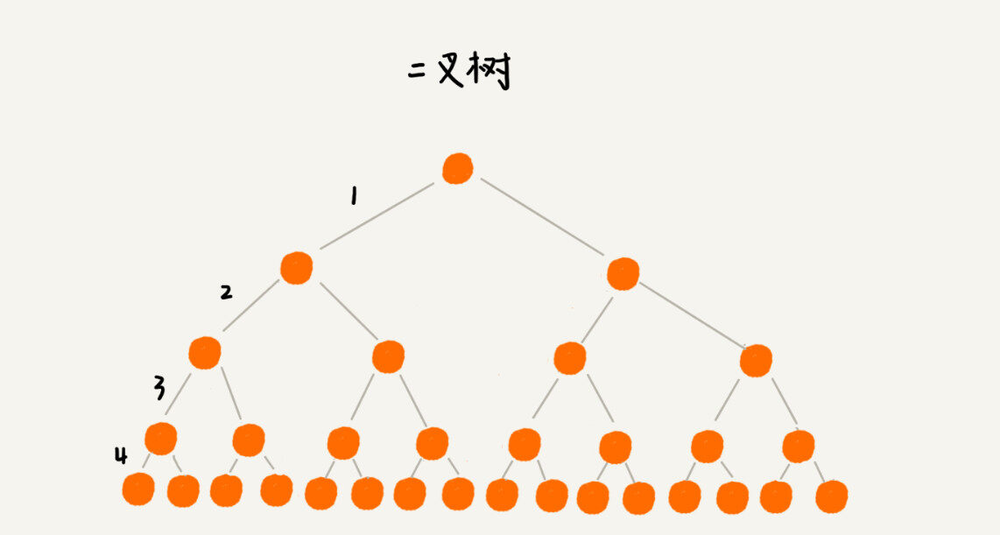
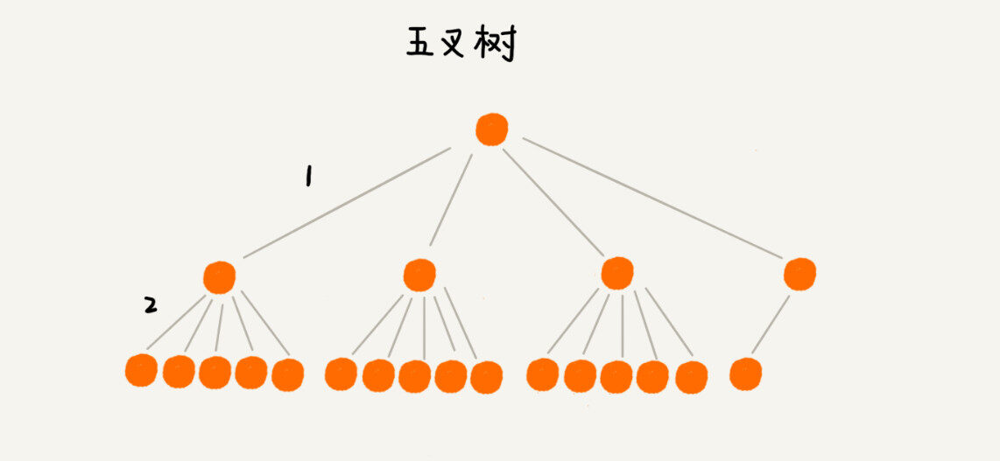
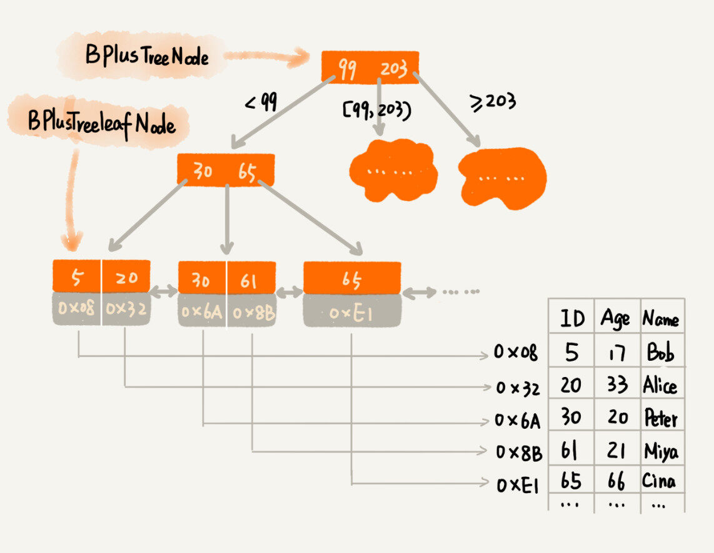
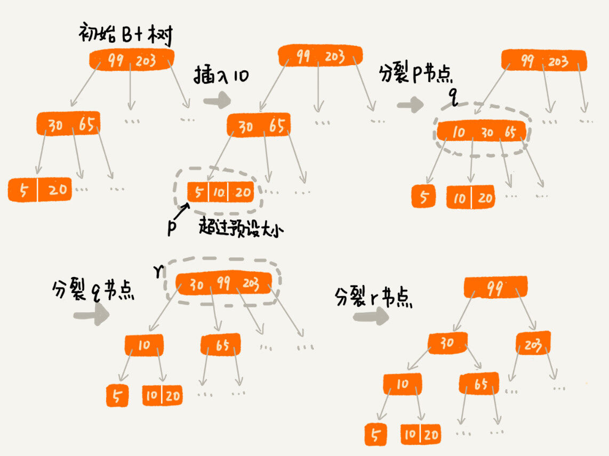
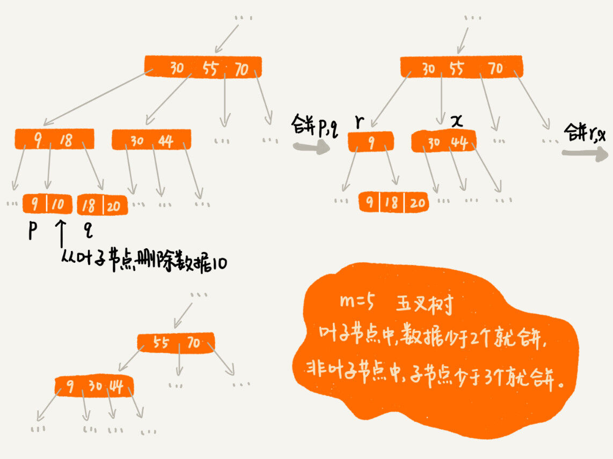

[TOC]

## 48 | B+ 树： MySQL 数据库索引是如何实现的？

1. 开篇题
	- 数据库的索引是如何实现的呢？底层使用的是什么数据结构和算法呢？

### 定义问题

1. 功能需求：
    - 根据**某个值**查找数据，如 `select * from user where id = 1234;`
    - 根据**区间值**来查找某些数据，如 `select * from user where id > 1234 and id < 2345;`
2. 非功能需求 -- **性能方面**的需求
    - 在**执行效率**方面，我们希望通过索引，查询的效率尽可能的高。
    - 在**存储空间**方面，我们希望索引不会消耗太多的内存空间。

### 先尝试解决问题

1. **散列表**
    - 单个值，查询性能很好，时间复杂度是 O(1)。
    - 散列表不能支持按区间快速查找数据。
    - 所以，散列表不能满足我们的需求。
2. **平衡二叉查找树**
    - 查询性能也很高，时间复杂度是 O(logn)。
    - 对树进行中序遍历，我们还可以得到一个从小到大的有序数据序列。
    - 但这仍然不足以支持按区间快速查找数据。
3. **跳表**
    - 它支持快速插入、查找、删除数据，对应的时间复杂度是 O(logn)。
    - 跳表也支持按照区间快速查找数据。
    - 

### 改造二叉查找树

1. 改造思路
    - 树的节点中并不存储数据本身，而是只是作为索引。
    - 把每个叶子节点串在一条链表上，链表中的数据是从小到大有序的。

2. 改造后的二叉树

    - 

3. 改造后，查询某个区间数据。

    - 

4. 思考

    - 如果数据量太大，那内存占用就会非常多。那如何解决这个索引占用太多内存的问题呢？

    - **我们可以借助时间换空间的思路，把索引存储在硬盘中，而非内存中。**
    - 这种将索引存储在硬盘中的方案，尽管减少了内存消耗，但是在数据查找的过程中，读取磁盘中的索引，就对应一次硬盘 IO 操作。**树的高度就等于每次查询数据时磁盘 IO 操作的次数。**
    - 由于磁盘 IO 非常耗时，所以我们优化的重点就是尽量减少磁盘 IO 操作。也就是降低树的高度。

5. 如何降低树的高度呢？

    - 我们把二叉树变为 5 叉树，那么树的高度就变小了（磁盘 IO 变少了），查找数据效率也就提高了。
    - 
    - 
    - 

6. 用 m 叉树实现 B+ 树索引（假设我们给 int 类型的数据库字段添加索引，所以代码中 keywords 是int 类型的）

    - ```java
        /**
         * 这是 B+ 树非叶子节点的定义。
         *
         * 假设 keywords=[3, 5, 8, 10]
         * 4 个键值将数据分为 5 个区间：(-INF,3), [3,5), [5,8), [8,10), [10,INF)
         * 5 个区间分别对应：children[0]...children[4]
         *
         * m 值是事先计算得到的，计算的依据是让所有信息的大小正好等于页的大小：
         * PAGE_SIZE = (m-1)*4[keywordss 大小]+m*8[children 大小]
         */
        public class BPlusTreeNode {
          public static int m = 5; // 5 叉树
          public int[] keywords = new int[m-1]; // 键值，用来划分数据区间
          public BPlusTreeNode[] children = new BPlusTreeNode[m];// 保存子节点指针
        }
        
        /**
         * 这是 B+ 树中叶子节点的定义。
         *
         * B+ 树中的叶子节点跟内部结点是不一样的,
         * 叶子节点存储的是值，而非区间。
         * 这个定义里，每个叶子节点存储 3 个数据行的键值及地址信息。
         *
         * k 值是事先计算得到的，计算的依据是让所有信息的大小正好等于页的大小：
         * PAGE_SIZE = k*4[keyw.. 大小]+k*8[dataAd.. 大小]+8[prev 大小]+8[next 大小]
         */
        public class BPlusTreeLeafNode {
          public static int k = 3;
          public int[] keywords = new int[k]; // 数据的键值
          public long[] dataAddress = new long[k]; // 数据地址
        
          public BPlusTreeLeafNode prev; // 这个结点在链表中的前驱结点
          public BPlusTreeLeafNode next; // 这个结点在链表中的后继结点
        }
        
        ```

7. m 叉树中的 m 越大，那树的高度就越小，那 m 叉树中的 m 是不是越大越好呢？到底多大才最合适呢？

    - 一次 IO，通常会读取一页的数据。如果一次读取量超过一页大小，就会触发多次 IO 操作。**所以我们在选择 m 大小时，要尽量让每个节点的大小等于一个页的大小**。这样，读取一个节点，只需要一次磁盘 IO 操作。
    - 

8. 索引有利有弊，它也会让写入数据的效率下降。为什么呢？

    - 在数据写入的过程，会涉及**索引的更新**。（变慢的主要原因）

9. 在数据插入的过程中，会导致某些节点的子节点个数超过 m，这个节点的大小超过一个页的大小，读取这样一个节点，就会导致多次 IO 操作。我们该如何处理呢？

    - 思路并不复杂。
    - 我们只需要**将这个节点分裂成两个节点**。
    - 节点分裂后，其上层父节点的子节点个数就有可能超过 m 个。不过这也没关系 ，我们可以用同样的方法，将父节点分裂成两个节点。
    - 这种级联反应会**从下往上**，一直影响到根节点。
    - 分裂过程：	
    - 

10. 频繁的数据删除，就会导致某些结点中，子节点的个数变得非常少，长此以往，如果每个节点的子节点都比较少，势必会影响索引的效率。
    - 我们可以设置一个阈值。
    - 当某个节点的子节点个数小于 m/2，我们就将它跟相邻的兄弟节点合并。
    - 不过合并后结点的子节点个数有可能会超过 m 。针对这种情况，我们可以借助插入数据时的处理方法，再分裂节点。
    - 分裂过程
    - 

