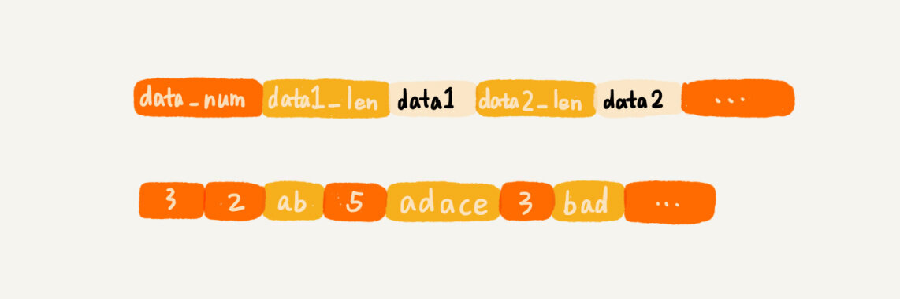
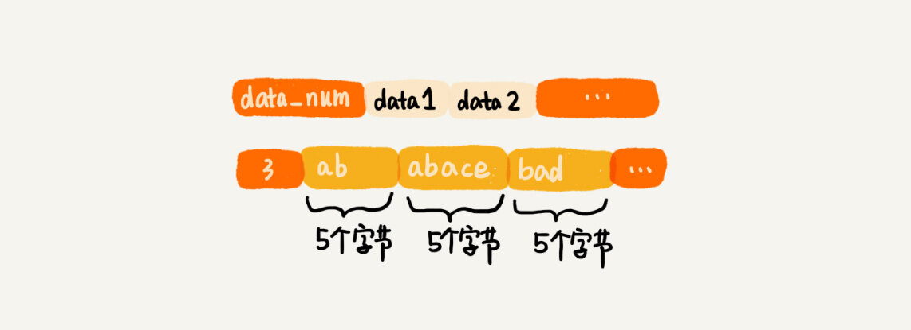

[TOC]

## 52 | 算法实战（一）：剖析 Redis 常用数据类型对应的数据结构

1. 开篇题
	- 我们一起看下，经典数据库 Redis 中常用数据类型，底层都是用哪种数据结构实现的？

### Redis 数据库介绍

1. 是一个种 Key-Value 数据库。也被叫作**非关系型数据库**。
2. 数据存储结构简单，读写效率非常高。
3. 数据存储在内存中。
4. 常用的数据类型：
	- 分别是字符串、列表、字典、集合、有序集合。

### 列表（list）

1. 这种数据结构支持存储一组数据。

2. 实现方法：
    - **压缩列表（ziplist）**
    - 双向循环链表
3. 压缩列表
    - 满足条件：
        1. 列表中保存的单个数据（有可能是字符串类型）小于 64 字节。
        2. 列表中数据个数少于 512 个
    - 特点
        1. 不是基础数据结构，Redis 自己设计的一种数据结构。
        2. 使用连续的内存空间
        3. 允许存储的数据大小不同（相比数组来说）
            - 压缩列表
            	- 
            - 数组
            	- 


4. 双向循环链表
  - 当不能满足刚刚讲的条件，就要通过**双向循环链表**来实现

  - Redis 双向循环链表这种数据结构，额外定义了一个 list 结构体，来组织链表的首、尾指针，还有长度信息。

  - 代码实现

    - ```c
      
      // 以下是C语言代码，因为Redis是用C语言实现的。
      typedef struct listnode {
        struct listNode *prev;
        struct listNode *next;
        void *value;
      } listNode;
      
      
      typedef struct list {
        listNode *head;
        listNode *tail;
        unsigned long len;
        // ....省略其他定义
      } list;
      ```

    - 

### 字典（hash）

1. 用来存储一组数据对。每个数据对又包含键值两部分。
2. 实现方式
    - 压缩列表
    - 散列表
3. 压缩列表：
    - 满足条件：
        1. 字典中保存的键和值都要小于 64 字节。
        2. 字典中键值对个数要小于 512 个。
4. 散列表
    - 当不能同时满足上面两个条件时候，Redis 就使用**散列表**来实现字典类型。
    - Redis 使用 **MurmurHash2** 这种运行速度快、随机性好的哈希算法作为哈希函数。
    - 对于哈希冲突的问题，Redis 使用**链表法**来解决。
    - Redis 还支持散列表的动态**扩容、缩容**。
    - Redis 使用我们`散列表（中）`讲的**渐近式扩容策略**，将数据的搬移分批进行，避免了大量数据一次性搬移导致的服务停顿。

### 集合（set）

1. 用来存储一组不重复的数据。
2. 实现方法：
    - **有序数组**
    - **散列表**
3. 有序数组
    - 满足条件：
        1. 存储的数据都是整数
        2. 存储的数据元素个数不超过 512 个
4. 散列表
    - 当不能同时满足这两个条件的时候，Redis 就使用散列表来存储集合中的数据。

### 有序集合（sortedset）

1. 存储一组数据，并且每个数据会附带一个**得分**。
2. 跳表
	- 通过得分的大小，我们将数据组织成**跳表**这样的数据结构，以支持快速地按照**得分、得分区间**获取数据。
3. 压缩列表
    - 满足条件：
        1. 所有数据的大小都要小于 64 字节
        2. 元素个数要小于 128 个

### 数据结构持久化

1. 两种解决思路：
    1. 清除原有存储结构，只将数据存储到磁盘中。
    2. 保留原来的存储格式，将数据按照原有格式存储在磁盘中。
